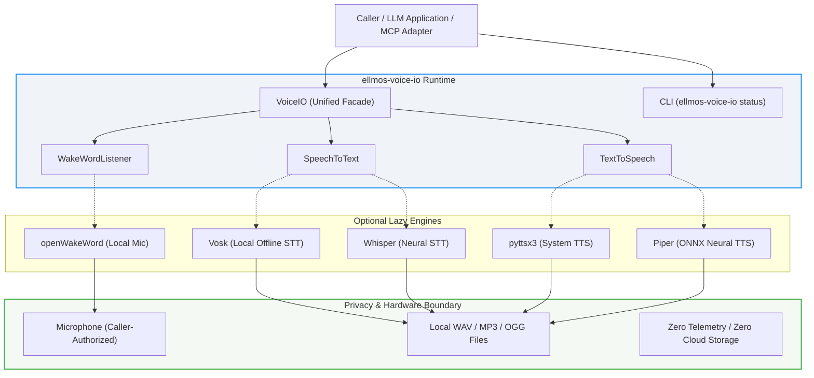
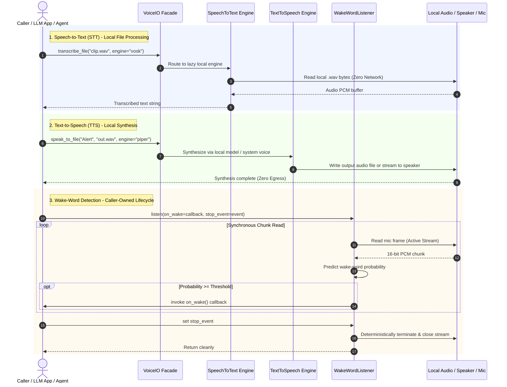

<p align="center">
  
</p>

# ellmos-voice-io

[](https://www.python.org/)
[](CHANGELOG.md)
[](.github/workflows/ci.yml)
[](https://github.com/astral-sh/ruff)
[](tests/)
[](pyproject.toml)
[](README.md#9-privacy-and-hardware-boundaries)
[](SECURITY.md)
[](SECURITY.md)
[](LICENSE)
[](https://github.com/ellmos-ai)
[](https://github.com/open-bricks)
[](llms.txt)

**[English](README.md)** | **[Deutsch](README_de.md)**

> [!TIP]
> **Machine-Readable Documentation:** An [`llms.txt`](llms.txt) index is provided for AI agents, LLMs, and automated RAG pipelines.

### Quick Navigation

- [1. Executive Summary](#1-executive-summary)
- [2. System Architecture & Component Flow](#2-system-architecture--component-flow)
- [3. Audio Lifecycle & Event Flow](#3-audio-lifecycle--event-flow)
- [4. Safety Model & Governance Invariants](#4-safety-model--governance-invariants)
- [5. Scope & Supported Engines](#5-scope--supported-engines)
- [6. Installation & Environment Setup](#6-installation--environment-setup)
- [7. Read-Only CLI Operations](#7-read-only-cli-operations)
- [8. Python API Integration](#8-python-api-integration)
- [9. Privacy and Hardware Boundaries](#9-privacy-and-hardware-boundaries)
- [10. Target Personas & Discoverability](#10-target-personas--discoverability)
- [11. Third-Party Licenses & Dependency Audits](#11-third-party-licenses--dependency-audits)
- [12. Ecosystem & Sibling Tools](#12-ecosystem--sibling-tools)
- [13. Development Status & Roadmap](#13-development-status--roadmap)
- [14. Provenance & History Boundary](#14-provenance--history-boundary)
- [15. Security & Vulnerability Reporting](#15-security--vulnerability-reporting)
- [16. License, Attribution & German Documentation](README_de.md)

---

## 1. Executive Summary

`ellmos-voice-io` provides local-first speech input, speech output, and wake-word helpers for LLM systems, agent runtimes, and desktop applications.

`ellmos-voice-io` is a lightweight, LLM-neutral runtime module. It does not run a server, store recordings, ship voice models, or choose a cloud provider. A caller explicitly selects optional local engines and owns all microphone permissions, model downloads, retention, and any networked integration.

| If you want to... | Open this |
|---|---|
| Inspect component architecture | [2. System Architecture & Component Flow](#2-system-architecture--component-flow) |
| Trace audio & wake-word execution | [3. Audio Lifecycle & Event Flow](#3-audio-lifecycle--event-flow) |
| Review safety invariants & SLA | [4. Safety Model & Governance Invariants](#4-safety-model--governance-invariants) |
| Install package & optional extras | [6. Installation & Environment Setup](#6-installation--environment-setup) |
| Query engine availability via CLI | [7. Read-Only CLI Operations](#7-read-only-cli-operations) |
| Integrate Python STT/TTS/Wake-Word | [8. Python API Integration](#8-python-api-integration) |
| Review target personas & use cases | [10. Target Personas & Discoverability](#10-target-personas--discoverability) |
| Review third-party licenses & audits | [11. Third-Party Licenses & Dependency Audits](#11-third-party-licenses--dependency-audits) |
| Explore multi-agent sibling tools | [12. Ecosystem & Sibling Tools](#12-ecosystem--sibling-tools) |
| Read AI/LLM index file | [llms.txt](llms.txt) |
| Read the German guide | [README_de.md](README_de.md) |

---

## 2. System Architecture & Component Flow



---

## 3. Audio Lifecycle & Event Flow



---

## 4. Safety Model & Governance Invariants

The following 10 invariants govern all `ellmos-voice-io` runtime operations, CLI entrypoints, and engine bindings:

| # | Invariant | Guarantee | Enforcement Mechanism |
|---|---|---|---|
| 1 | **100% Local-First & Zero-Egress** | STT, TTS, and wake-word operations run entirely offline without telemetry or background cloud services. | Pure local processing; no outbound network calls initiated by default runtime. |
| 2 | **Non-Elevation (RunAsInvoker)** | Module runs strictly in unprivileged user space; never requests administrative or root elevation. | Operates in user space; uses standard platform APIs and user-level audio bindings. |
| 3 | **Explicit Model Download Consent** | No implicit network connections or silent downloads for Whisper models. | Mandatory `allow_model_download=True` opt-in flag; offline local model file required otherwise. |
| 4 | **Deterministic Microphone Lifecycle** | Audio capture hardware is accessed solely during active synchronous `WakeWordListener.listen()` calls. | Audio streams terminated deterministically in `finally` blocks; pre-set stop events exit immediately. |
| 5 | **Caller-Owned Audio Retention** | System never stores recordings, transcripts, or syntheses in hidden caches or internal databases. | Audio files read from and written to caller-specified paths only; zero telemetry persistence. |
| 6 | **Lazy Engine Isolation** | Heavy optional dependencies (Whisper, Vosk, pyttsx3, Piper, openWakeWord) load lazily on demand. | Deferred imports inside engine wrappers; unrequested engines never allocate process memory. |
| 7 | **Read-Only Inspection CLI** | `ellmos-voice-io status` outputs structured availability JSON without opening hardware or downloading files. | Pure environment introspection with `importlib.util.find_spec` and zero hardware side effects. |
| 8 | **Cross-Platform Operating Parity** | Consistent runtime behavior across Windows, Linux, and macOS environments. | Multi-OS GitHub Actions CI matrix with Python 3.10, 3.11, and 3.12 validation. |
| 9 | **Cloud-Sync & Multi-Agent Defense** | Hardened against file locks and synchronization conflicts across distributed hosts. | `.gitignore` filters `LOCK.*`, `*.lock`, `*.sync-conflict-*`, `*.conflict`, and temporary files. |
| 10 | **48h Security SLA & Coordinated Disclosure** | Rapid vulnerability response with guaranteed acknowledgment and triage SLA. | Documented in `SECURITY.md` with 48h response, 5-day triage, and multi-inbox contact chain. |

---

## 5. Scope & Supported Engines

- **File-based STT**: Speech-to-Text through optional Whisper or Vosk.
- **File & Speaker TTS**: Text-to-Speech to speakers or files through optional pyttsx3 or Piper.
- **Local Wake-Word**: Real-time microphone wake-word detection through optional openWakeWord.
- **Stable Python API & Read-Only CLI**: Inspection via `status` CLI for Skills, MCP adapters, and desktop apps.

| Capability | Supported Engines | Input / Output | Key Feature |
|---|---|---|---|
| **Speech-to-Text** | `vosk`, `whisper` | `.wav` file $\to$ string | Fully offline with local model |
| **Text-to-Speech** | `pyttsx3`, `piper` | string $\to$ `.wav` / `.mp3` / `.ogg` or speaker | System voices or neural ONNX synthesis |
| **Wake-Word** | `openwakeword` | Microphone stream $\to$ callback | Synchronous, caller-owned stop event |

It intentionally does not replace audio workstations such as KlangpultLight or USBPodcastStudio. Their recording, editing, streaming, and transcript workflows remain application-specific consumers of this narrower capability.

---

## 6. Installation & Environment Setup

The package is not published to PyPI yet. Until an owner-approved release exists,
install it only from a trusted local checkout:

```bash
# Minimal base package (no optional heavy dependencies)
python -m pip install .

# Install with specific optional extras
python -m pip install ".[stt-vosk,tts-pyttsx3]"

# Development and verification toolchain
python -m pip install -e ".[dev]"
```

The `all` extra also installs `piper-tts`, whose current distribution is
GPL-3.0-or-later. Review [`THIRD_PARTY_LICENSES.md`](THIRD_PARTY_LICENSES.md)
and the licenses of any selected voice/model files before redistribution.

---

## 7. Read-Only CLI Operations

Inspect engine status safely without starting hardware or querying external endpoints:

```bash
ellmos-voice-io status
```

Output:
```json
{
  "stt_available": true,
  "stt_engine": "vosk",
  "tts_available": true,
  "tts_engine": "pyttsx3",
  "wakeword_available": false,
  "wakeword_engine": "Install the wakeword extra to access microphone-based wake words."
}
```

---

## 8. Python API Integration

### Speech-to-Text (STT)

```python
from ellmos_voice_io import SpeechToText

# Using Vosk with an explicit local model path
stt = SpeechToText(engine="vosk", model_path="/path/to/vosk-model-de")
transcript = stt.transcribe_file("input_voice.wav")
print(f"Transcribed: {transcript}")

# Using Whisper with an explicit local model file (no network access)
stt_whisper = SpeechToText(engine="whisper", model_path="/path/to/base.pt")
transcript_whisper = stt_whisper.transcribe_file("meeting_clip.wav", language="en")

# A named model may download only after explicit opt-in
stt_download = SpeechToText(
    engine="whisper",
    model_size="base",
    allow_model_download=True,
)
```

### Text-to-Speech (TTS)

```python
from ellmos_voice_io import TextToSpeech

tts = TextToSpeech(engine="pyttsx3", rate=160)

# Speak directly to system default speakers
tts.speak("Processing complete.")

# Export synthesis directly to an audio file (.wav, .mp3, .ogg)
tts.speak_to_file("Notification sound generated.", "output/alert.wav")
```

### Wake-Word Listener

```python
import threading
from ellmos_voice_io import WakeWordListener

def on_wake():
    print("Wake word detected! Activating assistant...")

stop_event = threading.Event()
listener = WakeWordListener(threshold=0.6)

# Blocks until stop_event is set; handles cleanup automatically
listener.listen(on_wake=on_wake, stop_event=stop_event)
```

---

## 9. Privacy and Hardware Boundaries

- **Audio, transcripts, and generated files stay where the caller puts them.**
- **No telemetry, database, account requirement, background service, or implicit upload.**
- **Microphone access occurs only during active `WakeWordListener.listen()`.**
- **No implicit Whisper download**: provide a local model file or opt in with
  `allow_model_download=True`; the caller then owns network and model-license policy.
- **Read-only CLI**: `status` never attempts permissions or model downloads.

### Wake-Word Lifecycle Contract

`WakeWordListener.listen(on_wake, stop_event)` is synchronous and caller-owned:
- A pre-set stop event returns immediately without opening audio hardware.
- Every audio chunk with a prediction at or above the threshold invokes the callback once. Debouncing remains caller policy.
- The stop event is checked before every read cycle. Model, stream, and read exceptions propagate safely after audio stream termination and cleanup.

---

## 10. Target Personas & Discoverability

`ellmos-voice-io` is purpose-built for four primary developer and operational personas:

1. **Autonomous Local AI Agent Developers & Swarm Operators:** Add lightweight, zero-overhead speech transcription, audio synthesis, and hands-free wake-word detection to agent frameworks (Claude Code, Antigravity, Codex, Kimi, n8n) without deploying bloated background daemons or incurring recurring cloud API token fees.
2. **Privacy-Conscious Desktop Application Engineers:** Build desktop applications with PySide6, PyQt, Tkinter, or Electron local bridges requiring offline dictation or system voice synthesis that operates 100% locally and complies with stringent privacy regulations.
3. **Edge & Embedded AI Engineers:** Deploy local wake-word detection and speech synthesis on Raspberry Pi, mini-PCs, or air-gapped industrial kiosks with deterministic microphone lifecycle and immediate resource cleanup.
4. **Enterprise Security & Compliance Officers:** Enforce air-gapped audio isolation, zero external network egress (`INV-LOCAL-01`), unprivileged user-mode execution (`INV-PRIV-02`), and complete transparency over third-party licenses and model acquisition.

For detailed search queries, bilingual discoverability matrices, and competitive breakdowns, consult [`MARKETING-LOG.txt`](MARKETING-LOG.txt).

---

## 11. Third-Party Licenses & Dependency Audits

The base wheel of `ellmos-voice-io` contains **zero external runtime dependencies** (`dependencies = []`), eliminating third-party supply-chain attack vectors.

Optional speech and wake-word engines are decoupled into explicit extras:
- **Core Runtime & Facade:** MIT License (100% permissive).
- **Vosk STT (`stt-vosk`):** Apache-2.0 License.
- **OpenAI Whisper STT (`stt-whisper`):** MIT License (caller-owned network opt-in).
- **pyttsx3 TTS (`tts-pyttsx3`):** MPL-2.0 License (uses native operating system voices).
- **openWakeWord (`wakeword`):** Apache-2.0 License.
- **PyAudio & NumPy (`wakeword`):** MIT / BSD-3-Clause.
- **Piper TTS (`tts-piper`):** **GPL-3.0-or-later** (isolated copyleft engine; optional and never bundled in the base distribution).

For comprehensive dependency audits, system tool boundaries (FFmpeg), and model weights licenses, review [`THIRD_PARTY_LICENSES.md`](THIRD_PARTY_LICENSES.md).

---

## 12. Ecosystem & Sibling Tools

Part of the [ellmos-ai](https://github.com/ellmos-ai) multi-agent infrastructure and the overarching [open-bricks](https://github.com/open-bricks) open-source software ecosystem:

| Tool | Organization | Description |
|------|--------------|-------------|
| [ellmos-core](https://github.com/ellmos-ai/ellmos-core) | ellmos-ai | Modular AI runtime, task dispatching & agent state substrate |
| [ellmos-scheduler](https://github.com/ellmos-ai/ellmos-scheduler) | ellmos-ai | Local cron, interval & scheduled task execution engine |
| [clutch](https://github.com/ellmos-ai/clutch) | ellmos-ai | Adaptive multi-model LLM router & agent execution gear |
| [coma](https://github.com/ellmos-ai/coma) | ellmos-ai | Single-binary multi-agent orchestrator & execution coordinator |
| [gardener](https://github.com/ellmos-ai/gardener) | ellmos-ai | Local-first autonomous session and context memory engine |
| [prompt-evidence-collector](https://github.com/ellmos-ai/prompt-evidence-collector) | ellmos-ai | Audit-ready LLM interaction capture & cryptographic evidence store |
| [lock-master](https://github.com/ellmos-ai/lock-master) | ellmos-ai | Multi-agent file locking and concurrency control protocol |
| [ticket-master](https://github.com/ellmos-ai/ticket-master) | ellmos-ai | Autonomous ticket routing and task dispatching triage console |
| [ellmos-controlcenter-mcp](https://github.com/ellmos-ai/ellmos-controlcenter-mcp) | ellmos-ai | MCP runtime supervision, skill routing & tool bundle discovery |
| [ellmos-filecommander-mcp](https://github.com/ellmos-ai/ellmos-filecommander-mcp) | ellmos-ai | MCP file management, safe delete & archive operations server |
| [ellmos-codecommander-mcp](https://github.com/ellmos-ai/ellmos-codecommander-mcp) | ellmos-ai | MCP code analysis, AST transformations & format server |
| [ellmos-clatcher-mcp](https://github.com/ellmos-ai/ellmos-clatcher-mcp) | ellmos-ai | MCP clipboard & scratchpad manager with dry-run safety |
| [n8n-manager-mcp](https://github.com/ellmos-ai/n8n-manager-mcp) | ellmos-ai | MCP n8n workflow management, execution monitoring & node introspection |
| [skills](https://github.com/ellmos-ai/skills) | ellmos-ai | Multi-agent canonical capability library & agent catalog |
| [usb-podcast-studio](https://github.com/entertain-and-more/usb-podcast-studio) | entertain-and-more | Desktop audio workstation, soundboard & recording suite (Klangpult) |
| [companion-for-agy](https://github.com/ellmos-ai/companion-for-agy) | ellmos-ai | Terminal companion & PTY wrapper for Google Antigravity |
| [safe-start-for-codex](https://github.com/dev-bricks/safe-start-for-codex) | dev-bricks | Safe starter and permission isolator for Codex CLI sessions |
| [automizer-for-claude-desktop](https://github.com/dev-bricks/automizer-for-claude-desktop) | dev-bricks | Scheduled task automation manager for Claude Desktop |
| [DevCenter](https://github.com/dev-bricks/DevCenter) | dev-bricks | Developer control plane, repository dashboard & environment manager |
| [CodeBox](https://github.com/dev-bricks/CodeBox) | dev-bricks | Polyglot code snippet manager & developer workbench |
| [WikiStub-Seed](https://github.com/dev-bricks/WikiStub-Seed) | dev-bricks | Multilingual JSON knowledge skeleton with 630 stubs across 12 domains |
| [automation-master](https://github.com/ellmos-ai/automation-master) | ellmos-ai | Multi-host automation, scheduled task registry & health supervisor |
| [WinStorePackager](https://github.com/file-bricks/WinStorePackager) | file-bricks | Windows Store packaging, MSIX build & release automation tool |
| [policy-registry](https://github.com/ellmos-ai/policy-registry) | ellmos-ai | Autonomous compliance, audit and policy governance store |
| [open-bricks](https://github.com/open-bricks) | open-bricks | Umbrella catalog for open-source bricks, tools, and libraries |

---

## 13. Development Status & Roadmap

The current development gates, task plans, and next verifiable milestones are documented in [`ROADMAP.md`](ROADMAP.md).
The repository is public on GitHub and the package is not on PyPI. A visibility,
tag, release, or registry upload requires a separate owner decision; see
[`RELEASE_GATE.md`](RELEASE_GATE.md).

---

## 14. Provenance & History Boundary

This module preserves the generic, MIT-licensed core of an earlier internal
voice service: file STT, TTS file export, and wake-word integration. It is
rewritten as an independent, user-neutral package with explicit dependencies
and no legacy database or bridge bindings.

---

## 15. Security & Vulnerability Reporting

Security and privacy invariants are strictly maintained. For details on coordinated disclosure, supported versions, and our 48h response SLA, see [`SECURITY.md`](SECURITY.md).

---

## 16. License, Attribution & German Documentation

The repository's code and documentation are MIT licensed; see [LICENSE](LICENSE).
Optional engines, system tools, and voice/model files retain their own licenses;
see [THIRD_PARTY_LICENSES.md](THIRD_PARTY_LICENSES.md). Responsible-use and
deployment boundaries are documented in [SECURITY.md](SECURITY.md) and
[docs/ai-act-note.md](docs/ai-act-note.md). Contributions follow
[CONTRIBUTING.md](CONTRIBUTING.md) and [CODE_OF_CONDUCT.md](CODE_OF_CONDUCT.md).

For the German edition of this documentation, please consult **[README_de.md](README_de.md)**.
