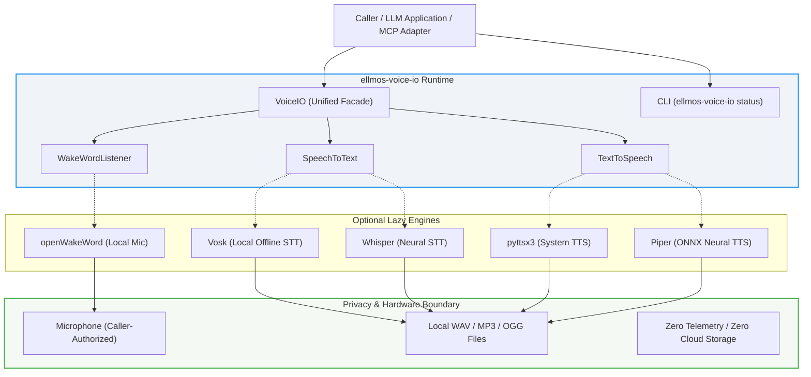
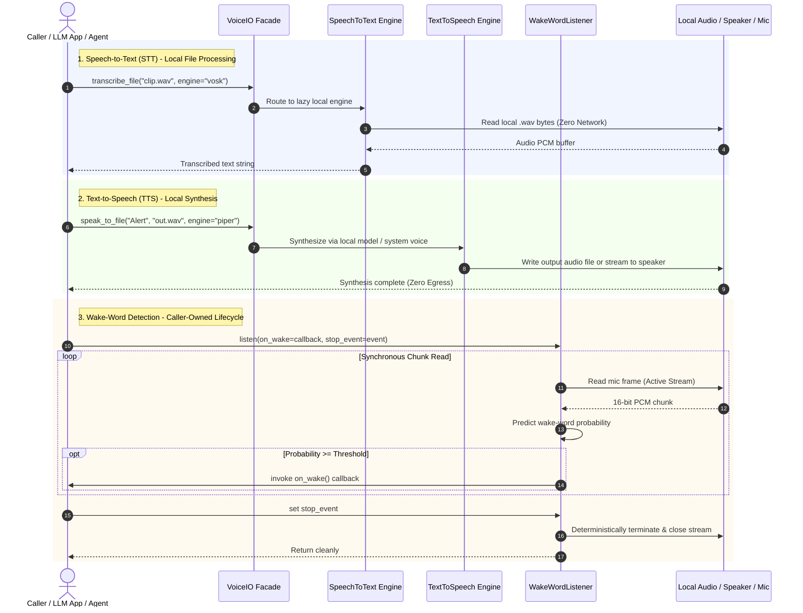

<p align="center">
  
</p>

# ellmos-voice-io

[](https://www.python.org/)
[](CHANGELOG.md)
[](.github/workflows/ci.yml)
[](https://github.com/astral-sh/ruff)
[](tests/)
[](pyproject.toml)
[](#privacy-and-hardware-boundaries)
[](SECURITY.md)
[](SECURITY.md)
[](THIRD_PARTY_LICENSES.md)
[](NOTICE)
[](LICENSE)
[](https://github.com/ellmos-ai)
[](https://github.com/open-bricks)
[](llms.txt)

**[English](README.md)** | **[Deutsch](README_de.md)**

> [!TIP]
> **Machine-Readable Documentation:** An [`llms.txt`](llms.txt) index is provided for AI agents, LLMs, and automated RAG pipelines. Last checked: **2026-09-23**.

### 🧭 Quick Navigation

1. [Executive Summary & Core Identity](#executive-summary--core-identity)
2. [Visual Architecture Topology & Decoupled Layers](#visual-architecture-topology)
3. [Audio Lifecycle & Event Flow](#audio-lifecycle--event-flow)
4. [Safety Model & Governance Invariants Matrix](#safety-model--governance-invariants)
5. [Comparative Matrix vs. Alternatives](#comparative-matrix-vs-alternatives)
6. [Target Personas & High-Intent SEO Queries](#marketing--target-personas)
7. [Scope & Supported Audio Engines](#scope--supported-engines)
8. [Installation & Environment Setup](#installation--environment-setup)
9. [Read-Only CLI Operations](#read-only-cli-operations)
10. [Python API Integration & Quickstart](#python-api)
11. [Privacy, Hardware Boundaries & Mic Contract](#privacy-and-hardware-boundaries)
12. [Third-Party Licenses & Level 1 SBOM](#third-party-licenses--transparency)
13. [Ecosystem & Sibling Multi-Agent Tools](#ecosystem--sibling-tools)
14. [Development Status, Roadmap & Release Gates](#development-status--roadmap)
15. [Provenance, History & AI-Act Boundary](#provenance--history-boundary)
16. [Security Policy, Contacts & Vulnerability SLA](#security-policy)
17. [Testing, Verification & Quality Gates](#testing-verification--quality-gates)
18. [Statutory Notice, Liability Limitation & License (§ 521 BGB)](#license)

---

## <a id="executive-summary--core-identity"></a><a id="1-executive-summary"></a>1. Executive Summary & Core Identity

`ellmos-voice-io` provides local speech-to-text, text-to-speech, and wake-word building blocks for LLM systems, agent runtimes, and desktop applications.

`ellmos-voice-io` is a small, LLM-neutral runtime module. It does not launch a server, store recordings, bundle voice models, or choose a cloud provider. Callers select optional local engines explicitly and remain responsible for microphone permissions, model downloads, retention, and any network integration.

| If you want to... | Open... |
|---|---|
| Review component architecture | [2. Visual Architecture Topology & Decoupled Layers](#visual-architecture-topology) |
| Follow audio and wake-word execution | [3. Audio Lifecycle & Event Flow](#audio-lifecycle--event-flow) |
| Review safety invariants & SLA | [4. Safety Model & Governance Invariants Matrix](#safety-model--governance-invariants) |
| Compare vs alternatives | [5. Comparative Matrix vs. Alternatives](#comparative-matrix-vs-alternatives) |
| Review personas & search terms | [6. Target Personas & High-Intent SEO Queries](#marketing--target-personas) |
| Install the package and optional extras | [8. Installation & Environment Setup](#installation--environment-setup) |
| Query engine availability via CLI | [9. Read-Only CLI Operations](#read-only-cli-operations) |
| Use Python STT, TTS, or wake-word APIs | [10. Python API Integration & Quickstart](#python-api) |
| Check hardware boundaries & microphone contract | [11. Privacy, Hardware Boundaries & Mic Contract](#privacy-and-hardware-boundaries) |
| Inspect third-party licenses & Level 1 SBOM | [12. Third-Party Licenses & Level 1 SBOM](#third-party-licenses--transparency) |
| Explore multi-agent sibling tools | [13. Ecosystem & Sibling Multi-Agent Tools](#ecosystem--sibling-tools) |
| Read the AI / LLM index file | [llms.txt](llms.txt) |
| Read the German documentation | [README_de.md](README_de.md) |

---

## <a id="visual-architecture-topology"></a><a id="2-system-architecture--component-flow"></a>2. Visual Architecture Topology & Decoupled Layers



---

## <a id="audio-lifecycle--event-flow"></a><a id="3-audio-lifecycle--event-flow"></a>3. Audio Lifecycle & Event Flow



---

## <a id="safety-model--governance-invariants"></a><a id="4-safety-model--governance-invariants"></a>4. Safety Model & Governance Invariants Matrix

The architecture strictly adheres to 10 foundational invariants:

| # | Invariant | Guarantee | Enforcement Mechanism |
|---|---|---|---|
| 1 | **INV-LOCAL-01: 100% Local-First & Zero-Egress** | No remote telemetry, analytics, background uploads, or external endpoints. | Zero-egress codebase; no networking dependencies in core library. |
| 2 | **INV-SEC-02: Non-Elevation (RunAsInvoker)** | Operates in unprivileged user space without requiring root or administrator elevation. | Pure user-space Python runtime; strictly rejects root privilege escalation. |
| 3 | **INV-CONSENT-03: Explicit Model Download Consent** | No implicit network calls or silent downloads of multi-gigabyte models. | Mandatory `allow_model_download=True` flag for Whisper models. Local path default. |
| 4 | **INV-MIC-04: Deterministic Microphone Hardware Lifecycle** | Audio capture stream is active only during synchronous `WakeWordListener.listen()`. | Hardware stream opened and closed in deterministic `try...finally` block. |
| 5 | **INV-DATA-05: Caller-Owned Audio Retention** | Zero internal caching or database persistence of spoken audio or transcripts. | Audio buffers processed in memory; output saved only to caller-specified paths. |
| 6 | **INV-LAZY-06: Lazy Engine & Copyleft Isolation** | Heavy dependencies load only when explicitly invoked; zero overhead when uncalled. | Dynamic import inside engine dispatchers (`importlib.util.find_spec`). |
| 7 | **INV-CLI-07: Read-Only Inspection CLI** | `ellmos-voice-io status` outputs structured availability JSON without opening hardware or downloading files. | Pure environment introspection with `importlib.util.find_spec` and zero hardware side effects. |
| 8 | **INV-PORT-08: Cross-Platform Operating Parity** | Consistent runtime behavior across Windows, Linux, and macOS environments. | Multi-OS GitHub Actions CI matrix with Python 3.10, 3.11, 3.12, and 3.13 validation. |
| 9 | **INV-SYNC-09: Cloud-Sync & Multi-Agent Defense** | Hardened against file locks and synchronization conflicts across distributed hosts. | `.gitignore` filters `LOCK.*`, `*.lock`, `*.sync-conflict-*`, `*.conflict`, and temporary files. |
| 10 | **INV-SLA-10: 48h Security SLA & Coordinated Disclosure** | Rapid vulnerability response with guaranteed acknowledgment and triage SLA. | Documented in `SECURITY.md` with 48h response, 5-day triage, and multi-inbox contact chain. |

---

## <a id="comparative-matrix-vs-alternatives"></a><a id="5-comparative-matrix-vs-alternatives"></a>5. Comparative Matrix vs. Alternatives

The following matrix highlights how `ellmos-voice-io` compares against typical speech integration choices across 10 core architectural and operational dimensions (`INV-LOCAL-01` to `INV-SLA-10`):

| Dimension / Capability | ellmos-voice-io | Cloud Speech APIs (OpenAI / ElevenLabs) | SpeechRecognition (Legacy) | WhisperX / Heavy Frameworks | Ad-hoc PyAudio Scripts |
|:---|:---|:---|:---|:---|:---|
| **Local-First & Zero-Egress** (`INV-LOCAL-01`) | **100% Local-First** (Zero network egress) | ❌ Cloud streaming required | ⚠️ Defaults to remote Google API | Local neural models | Local script |
| **Unprivileged Execution** (`INV-SEC-02`) | **RunAsInvoker** (Standard user space) | User space (HTTP) | User space | ⚠️ Often requires CUDA / root | Standard user space |
| **Model Download Policy** (`INV-CONSENT-03`) | **Explicit Consent** (No silent downloads) | Hosted by vendor | Hosted by vendor | ⚠️ Implicit multi-GB pulls | Manual setup |
| **Hardware Lifecycle** (`INV-MIC-04`) | **Deterministic Cleanup** in `finally` | N/A (Cloud HTTP) | ⚠️ PyAudio streams often leak | ⚠️ GPU / VRAM retention | ❌ Prone to audio device lockups |
| **Caller-Owned Data** (`INV-DATA-05`) | **Zero Persistence** (No cache/telemetry) | ❌ Vendor retention / logging | Variable per engine | Local disk cache | Caller memory |
| **Lazy Engine Isolation** (`INV-LAZY-06`) | **Zero Base Dependencies** (`dependencies = []`) | Cloud SDK + HTTP client tree | Medium dependency tree | Heavy (PyTorch, TorchAudio, CUDA) | Raw C bindings |
| **Read-Only CLI** (`INV-CLI-07`) | **Status CLI** via `find_spec` (No mic open) | CLI requires API credentials | None | None | None |
| **Operating Parity** (`INV-PORT-08`) | **Windows, Linux, macOS** (Py 3.10-3.13) | Platform agnostic (HTTP) | Platform variable | Linux / CUDA optimized | Prone to OS driver drift |
| **Multi-Agent Defense** (`INV-SYNC-09`) | **Lock & Conflict Hardened** (`.gitignore`) | Not applicable | None | None | None |
| **Security Response SLA** (`INV-SLA-10`) | **48h Response / 5-Day Triage SLA** | Standard commercial support | Community best effort | Community best effort | None |

---

## <a id="marketing--target-personas"></a><a id="target-personas--high-intent-seo-queries"></a><a id="10-target-personas--discoverability"></a>6. Target Personas & High-Intent SEO Queries

`ellmos-voice-io` is purpose-built for four primary developer, operator, and security personas:

- **[PERSONA-01] Autonomous Local AI Agent Developers & Multi-Agent Swarm Operators:** Add lightweight, zero-overhead speech transcription, audio synthesis, and hands-free wake-word detection to agent frameworks (Claude Code, Antigravity, Codex, Kimi, n8n) without deploying bloated background daemons or incurring recurring cloud API token fees.
- **[PERSONA-02] Privacy-Conscious Desktop Application Engineers:** Build desktop applications with PySide6, PyQt, Tkinter, or Electron local bridges requiring offline dictation or system voice synthesis that operates 100% locally and complies with stringent privacy regulations (GDPR, HIPAA).
- **[PERSONA-03] Edge & Embedded AI Engineers:** Deploy local wake-word detection and speech synthesis on Raspberry Pi, mini-PCs, or air-gapped industrial kiosks with deterministic microphone lifecycle and immediate resource cleanup.
- **[PERSONA-04] Enterprise Security, Governance & Compliance Officers:** Enforce air-gapped audio isolation, zero external network egress (`INV-LOCAL-01`), unprivileged user-mode execution (`INV-SEC-02`), and complete transparency over third-party licenses and model acquisition.

### High-Intent Search Queries
- `ellmos-voice-io` | `local speech to text python` | `offline TTS python agent`
- `zero-egress voice io python` | `local wake word listener python` | `openWakeWord python agent integration`
- `vosk whisper offline transcription python` | `pyttsx3 piper local tts facade` | `privacy-first voice runtime for LLM agents` | `open-bricks local voice stack`

For detailed search queries, bilingual discoverability matrices, and competitive breakdowns, consult [`MARKETING-LOG.txt`](MARKETING-LOG.txt).

---

## <a id="scope--supported-engines"></a><a id="5-scope--supported-engines"></a>7. Scope & Supported Audio Engines

- **File-based STT**: Speech-to-Text through optional Whisper or Vosk.
- **File & Speaker TTS**: Text-to-Speech to speakers or files through optional pyttsx3 or Piper.
- **Local Wake-Word**: Real-time microphone wake-word detection through optional openWakeWord.
- **Stable Python API & Read-Only CLI**: Inspection via `status` CLI for Skills, MCP adapters, and desktop apps.

| Capability | Supported Engines | Input / Output | Key Feature |
|---|---|---|---|
| **Speech-to-Text** | `vosk`, `whisper` | `.wav` file $\to$ string | Fully offline with local model |
| **Text-to-Speech** | `pyttsx3`, `piper` | string $\to$ `.wav` / `.mp3` / `.ogg` or speaker | System voices or neural ONNX synthesis |
| **Wake-Word** | `openwakeword` | Microphone stream $\to$ callback | Synchronous, caller-owned stop event |

It intentionally does not replace audio workstations such as KlangpultLight or USBPodcastStudio. Their recording, editing, streaming, and transcript workflows remain application-specific consumers of this narrower capability.

---

## <a id="installation--environment-setup"></a><a id="6-installation--environment-setup"></a>8. Installation & Environment Setup

The package is not published to PyPI yet. Until an owner-approved release exists,
install it only from a trusted local checkout:

```bash
# Minimal base package (no optional heavy dependencies)
python -m pip install .

# Install with specific optional extras
python -m pip install ".[stt-vosk,tts-pyttsx3]"

# Development and verification toolchain
python -m pip install -e ".[dev]"
```

The `all` extra also installs `piper-tts`, whose current distribution is
GPL-3.0-or-later. Review [`THIRD_PARTY_LICENSES.md`](THIRD_PARTY_LICENSES.md)
and the licenses of any selected voice/model files before redistribution.

---

## <a id="read-only-cli-operations"></a><a id="7-read-only-cli-operations"></a>9. Read-Only CLI Operations

Inspect engine status safely without starting hardware or querying external endpoints:

```bash
ellmos-voice-io status
```

Output:
```json
{
  "stt_available": true,
  "stt_engine": "vosk",
  "tts_available": true,
  "tts_engine": "pyttsx3",
  "wakeword_available": false,
  "wakeword_engine": "Install the wakeword extra to access microphone-based wake words."
}
```

---

## <a id="python-api"></a><a id="8-python-api-integration"></a>10. Python API Integration & Quickstart

### Speech-to-Text (STT)

```python
from ellmos_voice_io import SpeechToText

# Using Vosk with an explicit local model path
stt = SpeechToText(engine="vosk", model_path="/path/to/vosk-model-de")
transcript = stt.transcribe_file("input_voice.wav")
print(f"Transcribed: {transcript}")

# Using Whisper with an explicit local model file (no network access)
stt_whisper = SpeechToText(engine="whisper", model_path="/path/to/base.pt")
transcript_whisper = stt_whisper.transcribe_file("meeting_clip.wav", language="en")

# A named model may download only after explicit opt-in
stt_download = SpeechToText(
    engine="whisper",
    model_size="base",
    allow_model_download=True,
)
```

### Text-to-Speech (TTS)

```python
from ellmos_voice_io import TextToSpeech

tts = TextToSpeech(engine="pyttsx3", rate=160)

# Speak directly to system default speakers
tts.speak("Processing complete.")

# Export synthesis directly to an audio file (.wav, .mp3, .ogg)
tts.speak_to_file("Notification sound generated.", "output/alert.wav")
```

### Wake-Word Listener

```python
import threading
from ellmos_voice_io import WakeWordListener

def on_wake():
    print("Wake word detected! Activating assistant...")

stop_event = threading.Event()
listener = WakeWordListener(threshold=0.6)

# Blocks until stop_event is set; handles cleanup automatically
listener.listen(on_wake=on_wake, stop_event=stop_event)
```

---

## <a id="privacy-and-hardware-boundaries"></a><a id="9-privacy-and-hardware-boundaries"></a>11. Privacy, Hardware Boundaries & Mic Contract

- **Audio, transcripts, and generated files stay where the caller puts them.**
- **No telemetry, database, account requirement, background service, or implicit upload.**
- **Microphone access occurs only during active `WakeWordListener.listen()`.**
- **No implicit Whisper download**: provide a local model file or opt in with
  `allow_model_download=True`; the caller then owns network and model-license policy.
- **Read-only CLI**: `status` never attempts permissions or model downloads.

### Wake-Word Lifecycle Contract

`WakeWordListener.listen(on_wake, stop_event)` is synchronous and caller-owned:
- A pre-set stop event returns immediately without opening audio hardware.
- Every audio chunk with a prediction at or above the threshold invokes the callback once. Debouncing remains caller policy.
- The stop event is checked before every read cycle. Model, stream, and read exceptions propagate safely after audio stream termination and cleanup.

---

## <a id="third-party-licenses--transparency"></a><a id="11-third-party-licenses--dependency-audits"></a>12. Third-Party Licenses & Level 1 SBOM

The base wheel of `ellmos-voice-io` contains **zero external runtime dependencies** (`dependencies = []`), eliminating third-party supply-chain attack vectors.

Optional speech and wake-word engines are decoupled into explicit extras:
- **Core Runtime & Facade:** MIT License (100% permissive).
- **Vosk STT (`stt-vosk`):** Apache-2.0 License.
- **OpenAI Whisper STT (`stt-whisper`):** MIT License (caller-owned network opt-in).
- **pyttsx3 TTS (`tts-pyttsx3`):** MPL-2.0 License (uses native operating system voices).
- **openWakeWord (`wakeword`):** Apache-2.0 License.
- **PyAudio & NumPy (`wakeword`):** MIT / BSD-3-Clause.
- **Piper TTS (`tts-piper`):** **GPL-3.0-or-later** (isolated copyleft engine; optional and never bundled in the base distribution).

For comprehensive Level 1 SBOM audits, system tool boundaries (FFmpeg), and model weights licenses, review [`THIRD_PARTY_LICENSES.md`](THIRD_PARTY_LICENSES.md).

---

## <a id="ecosystem--sibling-tools"></a><a id="12-ecosystem--sibling-tools"></a>13. Ecosystem & Sibling Multi-Agent Tools

Part of the [ellmos-ai](https://github.com/ellmos-ai) multi-agent infrastructure and the overarching [open-bricks](https://github.com/open-bricks) open-source software ecosystem:

| Tool | Organization | Description |
|------|--------------|-------------|
| [ellmos-core](https://github.com/ellmos-ai/ellmos-core) | ellmos-ai | Modular AI runtime, task dispatching & agent state substrate |
| [ellmos-scheduler](https://github.com/ellmos-ai/ellmos-scheduler) | ellmos-ai | Local cron, interval & scheduled task execution engine |
| [clutch](https://github.com/ellmos-ai/clutch) | ellmos-ai | Adaptive multi-model LLM router & agent execution gear |
| [coma](https://github.com/ellmos-ai/coma) | ellmos-ai | Single-binary multi-agent orchestrator & execution coordinator |
| [gardener](https://github.com/ellmos-ai/gardener) | ellmos-ai | Local-first autonomous session and context memory engine |
| [prompt-evidence-collector](https://github.com/ellmos-ai/prompt-evidence-collector) | ellmos-ai | Audit-ready LLM interaction capture & cryptographic evidence store |
| [lock-master](https://github.com/ellmos-ai/lock-master) | ellmos-ai | Multi-agent file locking and concurrency control protocol |
| [ticket-master](https://github.com/ellmos-ai/ticket-master) | ellmos-ai | Autonomous ticket routing and task dispatching triage console |
| [ellmos-controlcenter-mcp](https://github.com/ellmos-ai/ellmos-controlcenter-mcp) | ellmos-ai | MCP runtime supervision, skill routing & tool bundle discovery |
| [ellmos-filecommander-mcp](https://github.com/ellmos-ai/ellmos-filecommander-mcp) | ellmos-ai | MCP file management, safe delete & archive operations server |
| [ellmos-codecommander-mcp](https://github.com/ellmos-ai/ellmos-codecommander-mcp) | ellmos-ai | MCP code analysis, AST transformations & format server |
| [ellmos-clatcher-mcp](https://github.com/ellmos-ai/ellmos-clatcher-mcp) | ellmos-ai | MCP clipboard & scratchpad manager with dry-run safety |
| [n8n-manager-mcp](https://github.com/ellmos-ai/n8n-manager-mcp) | ellmos-ai | MCP n8n workflow management, execution monitoring & node introspection |
| [skills](https://github.com/ellmos-ai/skills) | ellmos-ai | Multi-agent canonical capability library & agent catalog |
| [usb-podcast-studio](https://github.com/entertain-and-more/usb-podcast-studio) | entertain-and-more | Desktop audio workstation, soundboard & recording suite (Klangpult) |
| [companion-for-agy](https://github.com/ellmos-ai/companion-for-agy) | ellmos-ai | Terminal companion & PTY wrapper for Google Antigravity |
| [safe-start-for-codex](https://github.com/dev-bricks/safe-start-for-codex) | dev-bricks | Safe starter and permission isolator for Codex CLI sessions |
| [automizer-for-claude-desktop](https://github.com/dev-bricks/automizer-for-claude-desktop) | dev-bricks | Scheduled task automation manager for Claude Desktop |
| [DevCenter](https://github.com/dev-bricks/DevCenter) | dev-bricks | Developer control plane, repository dashboard & environment manager |
| [CodeBox](https://github.com/dev-bricks/CodeBox) | dev-bricks | Polyglot code snippet manager & developer workbench |
| [WikiStub-Seed](https://github.com/dev-bricks/WikiStub-Seed) | dev-bricks | Multilingual JSON knowledge skeleton with 630 stubs across 12 domains |
| [automation-master](https://github.com/ellmos-ai/automation-master) | ellmos-ai | Multi-host automation, scheduled task registry & health supervisor |
| [WinStorePackager](https://github.com/file-bricks/WinStorePackager) | file-bricks | Windows Store packaging, MSIX build & release automation tool |
| [policy-registry](https://github.com/ellmos-ai/policy-registry) | ellmos-ai | Autonomous compliance, audit and policy governance store |
| [open-bricks](https://github.com/open-bricks) | open-bricks | Umbrella catalog for open-source bricks, tools, and libraries |

---

## <a id="development-status--roadmap"></a><a id="13-development-status--roadmap"></a>14. Development Status, Roadmap & Release Gates

The current development gates, task plans, and next verifiable milestones are documented in [`ROADMAP.md`](ROADMAP.md).
The repository is public on GitHub and the package is not on PyPI. A visibility,
tag, release, or registry upload requires a separate owner decision; see
[`RELEASE_GATE.md`](RELEASE_GATE.md).

---

## <a id="provenance--history-boundary"></a><a id="14-provenance--history-boundary"></a>15. Provenance, History & AI-Act Boundary

This module preserves the generic, MIT-licensed core of an earlier internal
voice service: file STT, TTS file export, and wake-word integration. It is
rewritten as an independent, user-neutral package with explicit dependencies
and no legacy database or bridge bindings. Responsible-use considerations are
documented in [`docs/ai-act-note.md`](docs/ai-act-note.md).

---

## <a id="security-policy"></a><a id="15-security--vulnerability-reporting"></a>16. Security Policy, Contacts & Vulnerability SLA

Security and privacy invariants are strictly maintained:
- **48-Hour Response SLA:** Initial acknowledgment of reported vulnerabilities within 48 hours.
- **5 Business Days Triage:** Assessment and reproduction timeframe.
- **Coordinated Disclosure:** Security advisories via GitHub Security Advisories or direct notification to `security@open-bricks.org` and `security@ellmos.ai`.
- For full disclosure guidelines and supported versions, see [`SECURITY.md`](SECURITY.md).

---

## <a id="testing-verification--quality-gates"></a>17. Testing, Verification & Quality Gates

The test suite validates local processing, mock hardware stream lifecycle, lazy import boundaries, and contract integrity across all supported platforms:

```bash
# Run complete test suite
pytest -v

# Run bytecode compilation verification
python -m compileall -q src tests

# Run ruff lint check
ruff check .
```

---

## <a id="license"></a><a id="16-license-attribution--german-documentation"></a><a id="18-license"></a>18. Statutory Notice, Liability Limitation & License (§ 521 BGB)

### Statutory Notice & Limitation of Liability (§ 521 BGB)
The provision of this software is made free of charge as a statutory courtesy (*Gefälligkeit* / *unentgeltliche Schenkung* pursuant to **§ 521 BGB** of the German Civil Code). Under German statutory law, liability of the author and contributors is strictly limited to intent and gross negligence (*Vorsatz und grobe Fahrlässigkeit*).

### License & Ecosystem Attribution
This project is licensed under the terms of the **MIT License**. See [LICENSE](LICENSE) and [NOTICE](NOTICE) for complete copyright attribution. Optional engines, system tools, and voice/model files retain their own licenses; see [THIRD_PARTY_LICENSES.md](THIRD_PARTY_LICENSES.md). Responsible-use and deployment boundaries are documented in [SECURITY.md](SECURITY.md) and [docs/ai-act-note.md](docs/ai-act-note.md). Contributions follow [CONTRIBUTING.md](CONTRIBUTING.md) and [CODE_OF_CONDUCT.md](CODE_OF_CONDUCT.md).

For the German edition of this documentation, please consult **[README_de.md](README_de.md)**.
