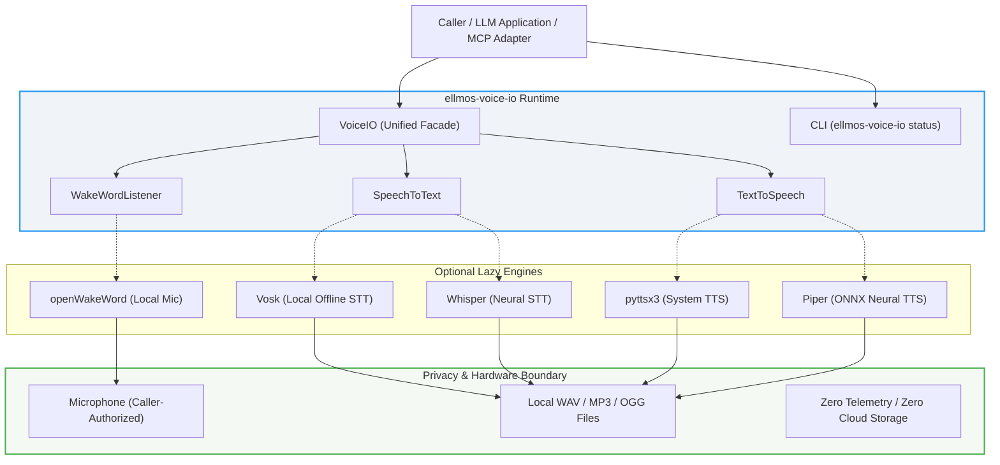
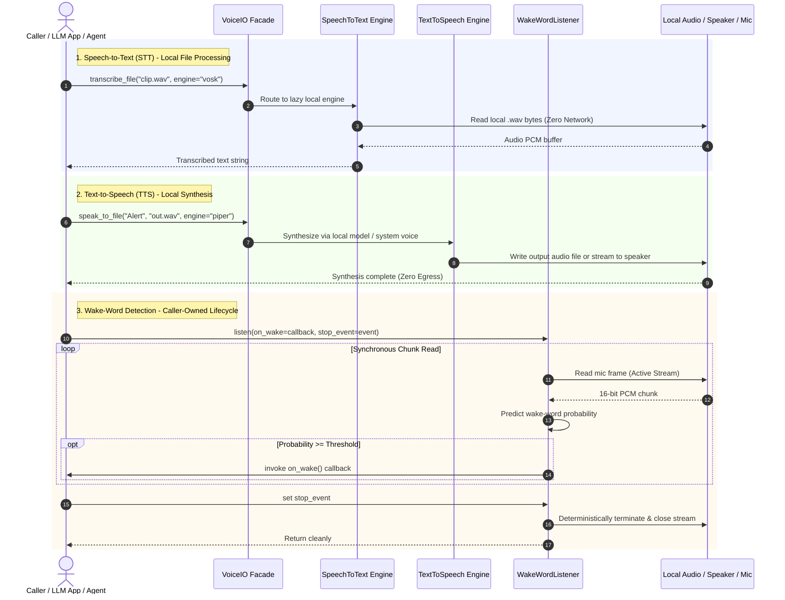

<p align="center">
  
</p>

# ellmos-voice-io

[](https://www.python.org/)
[](CHANGELOG.md)
[](.github/workflows/ci.yml)
[](https://github.com/astral-sh/ruff)
[](tests/)
[](pyproject.toml)
[](#datenschutz-und-hardware-grenzen)
[](SECURITY.md)
[](SECURITY.md)
[](THIRD_PARTY_LICENSES.md)
[](NOTICE)
[](LICENSE)
[](https://github.com/ellmos-ai)
[](https://github.com/open-bricks)
[](llms.txt)

**[English](README.md)** | **[Deutsch](README_de.md)**

> [!TIP]
> **Maschinenlesbare Dokumentation:** Ein [`llms.txt`](llms.txt)-Index steht für KI-Agenten, LLMs und automatisierte RAG-Pipelines bereit. Letzte Prüfung: **2026-09-20**.

### 🧭 Schnellnavigation

1. [Kurzfassung & Kernidentität](#management-zusammenfassung--kernidentitaet)
2. [Visuelle Architektur-Topologie & Entkoppelte Schichten](#visuelle-architektur-topologie)
3. [Audio-Lebenszyklus & Ereignisfluss](#audio-lebenszyklus--ereignisfluss)
4. [Sicherheitsmodell & Governance-Invarianten](#sicherheitsmodell--governance-invarianten)
5. [Vergleichsmatrix gegenüber Alternativen](#vergleichsmatrix-gegenueber-alternativen)
6. [Zielgruppen & Suchbegriffe](#marketing--zielgruppen)
7. [Umfang & Unterstützte Audio-Engines](#umfang--unterstuetzte-engines)
8. [Installation & Umgebungseinrichtung](#installation--umgebungseinrichtung)
9. [Rein lesende CLI-Bedienung](#rein-lesende-cli-bedienung)
10. [Python-API-Integration & Schnellstart](#python-api)
11. [Datenschutz, Hardware-Grenzen & Mikrofon-Vertrag](#datenschutz-und-hardware-grenzen)
12. [Drittanbieter-Lizenzen & Level-1-SBOM-Audit](#drittanbieter-lizenzen--transparenz)
13. [Ökosystem & Geschwister-Werkzeuge](#oekosystem--geschwisterwerkzeuge)
14. [Entwicklungsstatus, Roadmap & Freigabe-Tore](#entwicklungsstatus--roadmap)
15. [Provenienz, Historien-Grenze & AI-Act-Hinweis](#provenienz--historien-grenze)
16. [Sicherheitsrichtlinie, Kontakte & Schwachstellen-SLA](#sicherheitsrichtlinie)
17. [Tests, Verifikation & Qualitätstore](#tests-ausfuehren)
18. [Gesetzlicher Hinweis, Haftungsbeschränkung & Lizenz (§ 521 BGB)](#lizenz)

---

## <a id="management-zusammenfassung--kernidentitaet"></a><a id="1-kurzfassung"></a>1. Kurzfassung & Kernidentität

`ellmos-voice-io` stellt lokale Speech-to-Text-, Text-to-Speech- und Wake-Word-Hilfen für LLM-Systeme, Agenten-Laufzeiten und Desktop-Anwendungen bereit.

`ellmos-voice-io` ist ein kleines, LLM-neutrales Laufzeitmodul. Es startet keinen Server, speichert keine Aufnahmen, liefert keine Stimmmodelle aus und wählt keinen Cloud-Provider. Aufrufer wählen optionale lokale Engines ausdrücklich und verantworten Mikrofonberechtigungen, Modelldownloads, Aufbewahrung und jede Netzwerkintegration.

| Wenn Sie folgendes tun möchten... | Öffnen Sie... |
|---|---|
| Komponentenarchitektur einsehen | [2. Visuelle Architektur-Topologie & Entkoppelte Schichten](#visuelle-architektur-topologie) |
| Audio- und Wake-Word-Ausführung verfolgen | [3. Audio-Lebenszyklus & Ereignisfluss](#audio-lebenszyklus--ereignisfluss) |
| Sicherheitsinvarianten & SLA prüfen | [4. Sicherheitsmodell & Governance-Invarianten](#sicherheitsmodell--governance-invarianten) |
| Vergleich gegenüber Alternativen prüfen | [5. Vergleichsmatrix gegenüber Alternativen](#vergleichsmatrix-gegenueber-alternativen) |
| Zielgruppen & Suchbegriffe einsehen | [6. Zielgruppen & Suchbegriffe](#marketing--zielgruppen) |
| Paket & optionale Extras installieren | [8. Installation & Umgebungseinrichtung](#installation--umgebungseinrichtung) |
| Engine-Verfügbarkeit per CLI abfragen | [9. Rein lesende CLI-Bedienung](#rein-lesende-cli-bedienung) |
| Python STT/TTS/Wake-Word anbinden | [10. Python-API-Integration & Schnellstart](#python-api) |
| Datenschutz & Hardware-Grenzen prüfen | [11. Datenschutz, Hardware-Grenzen & Mikrofon-Vertrag](#datenschutz-und-hardware-grenzen) |
| Drittanbieter-Lizenzen & Level-1-SBOM prüfen | [12. Drittanbieter-Lizenzen & Level-1-SBOM-Audit](#drittanbieter-lizenzen--transparenz) |
| Multi-Agenten-Geschwister erkunden | [13. Ökosystem & Geschwister-Werkzeuge](#oekosystem--geschwisterwerkzeuge) |
| KI-/LLM-Indexdatei lesen | [llms.txt](llms.txt) |
| Den englischen Leitfaden lesen | [README.md](README.md) |

---

## <a id="visuelle-architektur-topologie"></a><a id="2-systemarchitektur--komponentenfluss"></a>2. Visuelle Architektur-Topologie & Entkoppelte Schichten



---

## <a id="audio-lebenszyklus--ereignisfluss"></a><a id="3-audio-lebenszyklus--ereignisfluss"></a>3. Audio-Lebenszyklus & Ereignisfluss



---

## <a id="sicherheitsmodell--governance-invarianten"></a><a id="4-sicherheitsmodell--governance-invarianten"></a>4. Sicherheitsmodell & Governance-Invarianten

Die Architektur befolgt strikt 10 fundamentale Invarianten:

| # | Invariante | Garantie | Durchsetzungsmechanismus |
|---|---|---|---|
| 1 | **INV-LOCAL-01: 100% Local-First & Zero-Egress** | Keine Telemetrie, Analyse, Hintergrund-Uploads oder externe Endpunkte. | Zero-Egress Codebasis; keinerlei Netzwerkabhängigkeiten in der Kernbibliothek. |
| 2 | **INV-SEC-02: Unprivilegierte Ausführung (RunAsInvoker)** | Läuft im unprivilegierten Benutzerbereich ohne Administrator- oder Root-Rechte. | Reine User-Space Python-Laufzeit; lehnt Privilegienerhöhung strikt ab. |
| 3 | **INV-CONSENT-03: Explizite Zustimmung zum Modelldownload** | Keine impliziten Netzwerkaufrufe oder stillen Downloads mehrgigabytegroßer Modelle. | Zwingendes `allow_model_download=True` Flag für Whisper-Modelle. Lokaler Pfad als Standard. |
| 4 | **INV-MIC-04: Deterministischer Mikrofon-Hardware-Lebenszyklus** | Audioaufnahmestream ist ausschließlich während synchronem `WakeWordListener.listen()` aktiv. | Hardwarestream wird in deterministischem `try...finally`-Block geöffnet und sofort geschlossen. |
| 5 | **INV-DATA-05: Datenhoheit beim Aufrufer** | Keine interne Zwischenspeicherung oder Datenbank-Persistierung gesprochener Audiodaten oder Transkripte. | Audio-Buffer werden flüchtig im RAM verarbeitet; Ausgabe nur an aufruferdefinierte Pfade. |
| 6 | **INV-LAZY-06: Lazy Engine & Copyleft-Isolation** | Schwere Abhängigkeiten laden erst bei explizitem Aufruf; null Overhead im Ruhezustand. | Dynamischer Import in Engine-Dispatchern (`importlib.util.find_spec`). |
| 7 | **INV-CLI-07: Rein lesende Inspektions-CLI** | `ellmos-voice-io status` liefert strukturierte JSON-Verfügbarkeitsdaten ohne Hardwarezugriff. | Reine Umgebungsinspektion via `importlib.util.find_spec` ohne Hardware-Seiteneffekte. |
| 8 | **INV-PORT-08: Plattformübergreifende Betriebsparität** | Einheitliches Laufzeitverhalten unter Windows, Linux und macOS. | Multi-OS GitHub Actions CI-Matrix mit Validierung unter Python 3.10, 3.11, 3.12 und 3.13. |
| 9 | **INV-SYNC-09: Cloud-Sync & Multi-Agenten-Schutz** | Schutz vor Dateisperren und Synchronisationskonflikten über verteilte Hosts. | `.gitignore` filtert `LOCK.*`, `*.lock`, `*.sync-conflict-*`, `*.conflict` und temporäre Dateien. |
| 10 | **INV-SLA-10: 48h Sicherheits-SLA & Koordinierte Offenlegung** | Schnelle Reaktion auf Schwachstellen mit garantierter Bestätigungs- und Triage-SLA. | Dokumentiert in `SECURITY.md` mit 48h Erstreaktion, 5-Tage-Triage und Multi-Inbox-Kontaktkette. |

---

## <a id="vergleichsmatrix-gegenueber-alternativen"></a><a id="5-vergleichsmatrix-gegenueber-alternativen"></a>5. Vergleichsmatrix gegenüber Alternativen

Die folgende Matrix zeigt, wie sich `ellmos-voice-io` im Vergleich zu typischen Sprachintegrationsansätzen entlang von 10 zentralen Architektur- und Betriebsdimensionen (`INV-LOCAL-01` bis `INV-SLA-10`) positioniert:

| Dimension / Eigenschaft | ellmos-voice-io | Cloud-Sprach-APIs (OpenAI / ElevenLabs) | SpeechRecognition (Legacy) | WhisperX / Schwere Frameworks | Ad-hoc PyAudio-Skripte |
|:---|:---|:---|:---|:---|:---|
| **Local-First & Zero-Egress** (`INV-LOCAL-01`) | **100% Local-First** (Kein Netzwerkausgang) | ❌ Zwingend Cloud-Streaming | ⚠️ Standardmäßig Google Web-API | Lokale neuronale Modelle | Lokales Skript |
| **Unprivilegierte Ausführung** (`INV-SEC-02`) | **RunAsInvoker** (Standard-Benutzerbereich) | Benutzerbereich (HTTP) | Benutzerbereich | ⚠️ Oft CUDA-/Root-Treiber nötig | Standard-Benutzerbereich |
| **Modelldownload-Richtlinie** (`INV-CONSENT-03`) | **Explizite Zustimmung** (Kein stiller Download)| Anbieterseitig gehostet | Anbieterseitig gehostet | ⚠️ Implizite Multi-GB-Downloads | Manuelle Einrichtung |
| **Hardware-Lebenszyklus** (`INV-MIC-04`) | **Deterministischer Cleanup** in `finally` | Entfällt (Cloud HTTP) | ⚠️ PyAudio-Streams lecken oft | ⚠️ GPU- / VRAM-Belegung | ❌ Anfällig für Hardware-Locks |
| **Datenhoheit beim Aufrufer** (`INV-DATA-05`) | **Keine interne Persistenz** (Kein Cache/Log) | ❌ Datenaufbewahrung beim Anbieter | Variabel je Engine | Lokaler Festplattencache | Aufrufer-Speicher |
| **Lazy Engine-Isolation** (`INV-LAZY-06`) | **Null Basis-Abhängigkeiten** (`dependencies = []`)| Cloud-SDKs + HTTP-Bibliotheken | Mittlerer Abhängigkeitsbaum | Schwer (PyTorch, TorchAudio, CUDA)| Rohe C-Bindings |
| **Rein lesende CLI** (`INV-CLI-07`) | **Status-CLI** via `find_spec` (Kein Mic-Open) | CLI verlangt API-Schlüssel | Keine | Keine | Keine |
| **Betriebssystem-Parität** (`INV-PORT-08`) | **Windows, Linux, macOS** (Py 3.10-3.13) | Plattformunabhängig (HTTP) | Plattformabhängig variabel | Linux / CUDA bevorzugt | Anfällig für OS-Treiberdrift |
| **Multi-Agenten-Schutz** (`INV-SYNC-09`) | **Lock- & Konflikthärtung** (`.gitignore`) | Nicht zutreffend | Keine | Keine | Keine |
| **Sicherheits-SLA** (`INV-SLA-10`) | **48h Reaktions- / 5-Tage-Triage-SLA** | Standard-Supportverträge | Best-Effort der Community | Best-Effort der Community | Keine |

---

## <a id="marketing--zielgruppen"></a><a id="10-zielgruppen--auffindbarkeit"></a>6. Zielgruppen & Suchbegriffe

`ellmos-voice-io` wurde gezielt für vier Entwickler-, Betreiber- und Sicherheits-Zielgruppen konzipiert:

- **[PERSONA-01] Entwickler autonomer lokaler KI-Agenten & Multi-Agenten-Schwärme:** Schlanke, unaufdringliche Spracherkennung, Audiosynthese und Wake-Word-Erkennung für Agenten-Frameworks (Claude Code, Antigravity, Codex, Kimi, n8n) ohne speicherhungrige Hintergrunddienste oder laufende Cloud-API-Kosten.
- **[PERSONA-02] Datenschutzbewusste Desktop-Anwendungsentwickler:** Desktop-Anwendungen mit PySide6, PyQt, Tkinter oder Electron, die 100% offline Sprachsteuerung oder lokale Sprachausgabe erfordern und strenge Datenschutzauflagen (DSGVO, HIPAA) erfüllen.
- **[PERSONA-03] Edge-, Embedded- & Kiosk-Audio-Ingenieure:** Lokale Wake-Word-Erkennung und Sprachausgabe auf Raspberry Pi, Mini-PCs oder Industrie-Terminals mit deterministischem Hardware-Lebenszyklus und sofortiger Ressourcenfreigabe.
- **[PERSONA-04] Enterprise-Sicherheits- & Governance-Verantwortliche:** Vollständige Offline-Audio-Isolation, Zero-Egress (`INV-LOCAL-01`), unprivilegierte Ausführung (`INV-SEC-02`) und lückenlose Transparenz über Drittanbieter-Lizenzen und Modellbeschaffung.

### Relevante Suchbegriffe (Deutsch)
- `ellmos-voice-io lokale Sprachverarbeitung` | `Offline Spracherkennung Python Vosk Whisper` | `Lokale Sprachausgabe Python pyttsx3 Piper`
- `Zero-Egress Audio Schnittstelle fuer KI-Agenten` | `Lokale Wake-Word Erkennung openWakeWord Python` | `Datenschutzkonforme Sprachsynthese Desktop App`
- `Offline Voice IO fuer lokale Sprachmodelle` | `Air-Gapped Speech to Text Python Bibliothek` | `Deterministischer Mikrofon Lebenszyklus Python` | `ellmos-ai Sprachverarbeitung Open-Source`

Ausführliche zweisprachige Suchmatrizen und Audit-Protokolle finden Sie in [`MARKETING-LOG.txt`](MARKETING-LOG.txt).

---

## <a id="umfang--unterstuetzte-engines"></a><a id="5-umfang--unterstuetzte-engines"></a>7. Umfang & Unterstützte Audio-Engines

- **Dateibasierte Spracherkennung (STT)**: Speech-to-Text über optionales Whisper oder Vosk.
- **Datei- & Lautsprecher-Sprachausgabe (TTS)**: Text-to-Speech auf Lautsprecher oder in Dateien über pyttsx3 oder Piper.
- **Lokale Wake-Word-Erkennung**: Echtzeit-Mikrofonerkennung über optionales openWakeWord.
- **Stabile Python-API & rein lesende CLI**: Statusinspektion via `status`-Befehl für Skills, MCP-Adapter und Desktop-Apps.

| Fähigkeit | Unterstützte Engines | Eingabe / Ausgabe | Kernmerkmal |
|---|---|---|---|
| **Speech-to-Text** | `vosk`, `whisper` | `.wav`-Datei $\to$ Text | Vollständig offline mit lokalem Modell |
| **Text-to-Speech** | `pyttsx3`, `piper` | Text $\to$ `.wav` / `.mp3` / `.ogg` oder Lautsprecher | Systemstimmen oder neuronale ONNX-Synthese |
| **Wake-Word** | `openwakeword` | Mikrofonstream $\to$ Callback | Synchrones, aufrufergesteuertes Stop-Event |

Es ersetzt ausdrücklich keine Audio-Workstations wie KlangpultLight oder USBPodcastStudio. Deren Aufnahme-, Schnitt-, Streaming- und Transkript-Workflows bleiben anwendungsspezifische Konsumenten dieser Basisfunktion.

---

## <a id="installation--umgebungseinrichtung"></a><a id="6-installation--umgebungseinrichtung"></a>8. Installation & Umgebungseinrichtung

Das Paket ist noch nicht auf PyPI veröffentlicht. Bis eine vom Eigentümer freigegebene Veröffentlichung vorliegt,
installieren Sie es ausschließlich aus einem vertrauenswürdigen lokalen Klon:

```bash
# Minimal base package (no optional heavy dependencies)
python -m pip install .

# Install with specific optional extras
python -m pip install ".[stt-vosk,tts-pyttsx3]"

# Development and verification toolchain
python -m pip install -e ".[dev]"
```

Das Extra `all` installiert zusätzlich `piper-tts`, dessen Distribution unter GPL-3.0-or-later steht.
Prüfen Sie vor einer Weitergabe [`THIRD_PARTY_LICENSES.md`](THIRD_PARTY_LICENSES.md) und die Lizenzen der gewählten Stimm- und Modelldateien.

---

## <a id="rein-lesende-cli-bedienung"></a><a id="7-rein-lesende-cli-bedienung"></a>9. Rein lesende CLI-Bedienung

Prüfen Sie den Engine-Status sicher, ohne Hardware zu aktivieren oder externe Endpunkte abzufragen:

```bash
ellmos-voice-io status
```

Ausgabe:
```json
{
  "stt_available": true,
  "stt_engine": "vosk",
  "tts_available": true,
  "tts_engine": "pyttsx3",
  "wakeword_available": false,
  "wakeword_engine": "Install the wakeword extra to access microphone-based wake words."
}
```

---

## <a id="python-api"></a><a id="8-python-api-integration"></a>10. Python-API-Integration & Schnellstart

### Speech-to-Text (STT)

```python
from ellmos_voice_io import SpeechToText

# Using Vosk with an explicit local model path
stt = SpeechToText(engine="vosk", model_path="/path/to/vosk-model-de")
transcript = stt.transcribe_file("input_voice.wav")
print(f"Transcribed: {transcript}")

# Using Whisper with an explicit local model file (no network access)
stt_whisper = SpeechToText(engine="whisper", model_path="/path/to/base.pt")
transcript_whisper = stt_whisper.transcribe_file("meeting_clip.wav", language="en")

# A named model may download only after explicit opt-in
stt_download = SpeechToText(
    engine="whisper",
    model_size="base",
    allow_model_download=True,
)
```

### Text-to-Speech (TTS)

```python
from ellmos_voice_io import TextToSpeech

tts = TextToSpeech(engine="pyttsx3", rate=160)

# Speak directly to system default speakers
tts.speak("Processing complete.")

# Export synthesis directly to an audio file (.wav, .mp3, .ogg)
tts.speak_to_file("Notification sound generated.", "output/alert.wav")
```

### Wake-Word Listener

```python
import threading
from ellmos_voice_io import WakeWordListener

def on_wake():
    print("Wake word detected! Activating assistant...")

stop_event = threading.Event()
listener = WakeWordListener(threshold=0.6)

# Blocks until stop_event is set; handles cleanup automatically
listener.listen(on_wake=on_wake, stop_event=stop_event)
```

---

## <a id="datenschutz-und-hardware-grenzen"></a><a id="9-datenschutz-und-hardware-grenzen"></a>11. Datenschutz, Hardware-Grenzen & Mikrofon-Vertrag

- **Audio, Transkripte und generierte Dateien verbleiben dort, wo der Aufrufer sie ablegt.**
- **Keine Telemetrie, keine Datenbank, keine Kontopflicht, kein Hintergrunddienst und kein impliziter Upload.**
- **Mikrofonzugriff erfolgt ausschließlich während aktivem `WakeWordListener.listen()`.**
- **Kein impliziter Whisper-Download**: Lokale Modelldatei angeben oder per `allow_model_download=True` explizit freigeben; der Aufrufer steuert Netzwerk- und Modellrichtlinien.
- **Rein lesende CLI**: `status` fordert weder Berechtigungen an noch lädt es Modelle herunter.

### Wake-Word-Lebenszyklus-Vertrag

`WakeWordListener.listen(on_wake, stop_event)` arbeitet synchron und aufrufergesteuert:
- Ein vorab gesetztes Stop-Event kehrt sofort zurück, ohne Audio-Hardware zu öffnen.
- Jeder Audio-Chunk mit einer Vorhersage ab Schwellenwert löst den Callback genau einmal aus. Entprellung obliegt dem Aufrufer.
- Das Stop-Event wird vor jedem Lesezyklus geprüft. Modell-, Stream- und Lesefehler werden nach der Beendigung des Streams sicher propagiert.

---

## <a id="drittanbieter-lizenzen--transparenz"></a><a id="11-drittanbieter-lizenzen--abhaengigkeits-audits"></a>12. Drittanbieter-Lizenzen & Level-1-SBOM-Audit

Das Basis-Wheel von `ellmos-voice-io` enthält **keine externen Laufzeit-Abhängigkeiten** (`dependencies = []`), was Angriffsvektoren in der Lieferkette ausschließt.

Optionale Sprach- und Wake-Word-Engines sind in getrennte Extras aufgeteilt:
- **Kernlaufzeit & Fassade:** MIT-Lizenz (100% permissiv).
- **Vosk STT (`stt-vosk`):** Apache-2.0-Lizenz.
- **OpenAI Whisper STT (`stt-whisper`):** MIT-Lizenz (aufrufergesteuerte Download-Freigabe).
- **pyttsx3 TTS (`tts-pyttsx3`):** MPL-2.0-Lizenz (nutzt Betriebssystem-eigene Stimmen).
- **openWakeWord (`wakeword`):** Apache-2.0-Lizenz.
- **PyAudio & NumPy (`wakeword`):** MIT / BSD-3-Clause.
- **Piper TTS (`tts-piper`):** **GPL-3.0-or-later** (isolierte Copyleft-Engine; optional und niemals im Basispaket gebündelt).

Detaillierte Level-1-SBOM-Audits, Systemgrenzen (FFmpeg) und Lizenzen der Modellgewichte finden Sie in [`THIRD_PARTY_LICENSES.md`](THIRD_PARTY_LICENSES.md).

---

## <a id="oekosystem--geschwisterwerkzeuge"></a><a id="12-oekosystem--geschwister-werkzeuge"></a>13. Ökosystem & Geschwister-Werkzeuge

Teil der [ellmos-ai](https://github.com/ellmos-ai) Multi-Agenten-Infrastruktur und des übergeordneten [open-bricks](https://github.com/open-bricks) Open-Source-Software-Ökosystems:

| Werkzeug | Organisation | Beschreibung |
|---|---|---|
| [ellmos-core](https://github.com/ellmos-ai/ellmos-core) | ellmos-ai | Modulare KI-Laufzeit, Task-Dispatching & Agenten-Status-Substrat |
| [ellmos-scheduler](https://github.com/ellmos-ai/ellmos-scheduler) | ellmos-ai | Lokale Cron-, Intervall- & Ausführungs-Engine für geplante Aufgaben |
| [clutch](https://github.com/ellmos-ai/clutch) | ellmos-ai | Adaptiver Multi-Modell LLM-Router & Agenten-Ausführungsgetriebe |
| [coma](https://github.com/ellmos-ai/coma) | ellmos-ai | Single-Binary Multi-Agenten-Orchestrierer & Koordinationskern |
| [gardener](https://github.com/ellmos-ai/gardener) | ellmos-ai | Lokale autonome Sitzungs- und Kontext-Speicher-Engine |
| [prompt-evidence-collector](https://github.com/ellmos-ai/prompt-evidence-collector) | ellmos-ai | Revisionssichere LLM-Interaktionserfassung & kryptografischer Evidenzspeicher |
| [lock-master](https://github.com/ellmos-ai/lock-master) | ellmos-ai | Multi-Agenten Dateisperr- und Nebenläufigkeitskontroll-Protokoll |
| [ticket-master](https://github.com/ellmos-ai/ticket-master) | ellmos-ai | Autonome Ticket-Routing- & Task-Dispatching-Triage-Konsole |
| [ellmos-controlcenter-mcp](https://github.com/ellmos-ai/ellmos-controlcenter-mcp) | ellmos-ai | MCP-Laufzeitüberwachung, Skill-Routing & Tool-Bundle-Erkennung |
| [ellmos-filecommander-mcp](https://github.com/ellmos-ai/ellmos-filecommander-mcp) | ellmos-ai | MCP-Dateiverwaltungs-, Safe-Delete- & Archivierungs-Server |
| [ellmos-codecommander-mcp](https://github.com/ellmos-ai/ellmos-codecommander-mcp) | ellmos-ai | MCP-Code-Analyse, AST-Transformationen & Formatierungs-Server |
| [ellmos-clatcher-mcp](https://github.com/ellmos-ai/ellmos-clatcher-mcp) | ellmos-ai | MCP-Zwischenablage & Scratchpad-Manager mit Dry-Run-Sicherheit |
| [n8n-manager-mcp](https://github.com/ellmos-ai/n8n-manager-mcp) | ellmos-ai | MCP-n8n-Workflow-Management, Ausführungsüberwachung & Node-Inspektion |
| [skills](https://github.com/ellmos-ai/skills) | ellmos-ai | Kanonische Multi-Agenten Fähigkeitsbibliothek & Agenten-Katalog |
| [usb-podcast-studio](https://github.com/entertain-and-more/usb-podcast-studio) | entertain-and-more | Desktop-Audio-Workstation, Soundboard & Recording-Suite (Klangpult) |
| [companion-for-agy](https://github.com/ellmos-ai/companion-for-agy) | ellmos-ai | Terminal-Begleiter & PTY-Wrapper für Google Antigravity |
| [safe-start-for-codex](https://github.com/dev-bricks/safe-start-for-codex) | dev-bricks | Sicherer Starter und Berechtigungsisolator für Codex-CLI-Sitzungen |
| [automizer-for-claude-desktop](https://github.com/dev-bricks/automizer-for-claude-desktop) | dev-bricks | Manager für geplante Aufgaben und Automatisierungen in Claude Desktop |
| [DevCenter](https://github.com/dev-bricks/DevCenter) | dev-bricks | Entwickler-Leitstand, Repository-Dashboard & Umgebungsmanager |
| [CodeBox](https://github.com/dev-bricks/CodeBox) | dev-bricks | Polyglotter Code-Snippet-Manager & Entwickler-Werkbank |
| [WikiStub-Seed](https://github.com/dev-bricks/WikiStub-Seed) | dev-bricks | Mehrsprachiges JSON-Wissensgerüst mit 630 Stubs über 12 Domänen |
| [automation-master](https://github.com/ellmos-ai/automation-master) | ellmos-ai | Multi-Host-Automatisierungs-, Task-Registry & Health-Supervisor |
| [WinStorePackager](https://github.com/file-bricks/WinStorePackager) | file-bricks | Windows Store Paketierungs-, MSIX-Build- & Release-Automationswerkzeug |
| [policy-registry](https://github.com/ellmos-ai/policy-registry) | ellmos-ai | Autonomer Governance-, Audit- und Compliance-Richtlinienspeicher |
| [open-bricks](https://github.com/open-bricks) | open-bricks | Dachkatalog für Open-Source-Bausteine, Werkzeuge und Bibliotheken |

---

## <a id="entwicklungsstatus--roadmap"></a><a id="13-entwicklungsstatus--roadmap"></a>14. Entwicklungsstatus, Roadmap & Freigabe-Tore

Aktuelle Entwicklungsstufen, Aufgabenpläne und die nächsten überprüfbaren Meilensteine sind in [`ROADMAP.md`](ROADMAP.md) dokumentiert.
Das Repository ist auf GitHub öffentlich und das Paket ist nicht auf PyPI. Eine Veröffentlichung,
ein Tag, Release oder Registry-Upload bedarf einer gesonderten Eigentümerentscheidung; siehe
[`RELEASE_GATE.md`](RELEASE_GATE.md).

---

## <a id="provenienz--historien-grenze"></a><a id="14-provenienz--historien-grenze"></a>15. Provenienz, Historien-Grenze & AI-Act-Hinweis

Dieses Modul bewahrt den generischen, MIT-lizenzierten Kern eines früheren internen
Sprachdienstes: Datei-STT, TTS-Dateiexport und Wake-Word-Integration. Es wurde als
unabhängiges, nutzerneutrales Paket mit expliziten Abhängigkeiten und ohne alte
Datenbank- oder Bridge-Bindungen neu strukturiert. Leitlinien für den verantwortungsvollen
Einsatz sind in [`docs/ai-act-note.md`](docs/ai-act-note.md) dokumentiert.

---

## <a id="sicherheitsrichtlinie"></a><a id="15-sicherheitsrichtlinie--meldewege"></a>16. Sicherheitsrichtlinie, Kontakte & Schwachstellen-SLA

Sicherheits- und Datenschutz-Invarianten werden strikt eingehalten:
- **48-Stunden-Reaktions-SLA:** Erste Rückmeldung zu gemeldeten Sicherheitslücken innerhalb von 48 Stunden.
- **5 Werktage Triage:** Bewertung und Reproduktionszeitraum.
- **Koordinierte Offenlegung:** Sicherheitsmeldungen über GitHub Security Advisories oder direkt an `security@open-bricks.org` und `security@ellmos.ai`.
- Vollständige Offenlegungsrichtlinien und unterstützte Versionen finden Sie in [`SECURITY.md`](SECURITY.md).

---

## <a id="tests-ausfuehren"></a>17. Tests, Verifikation & Qualitätstore

Die Testsuite validiert lokale Verarbeitung, Mock-Hardware-Stream-Lebenszyklen, Lazy-Import-Grenzen und Vertragsintegrität auf allen unterstützten Plattformen:

```bash
# Run complete test suite
pytest -v

# Run bytecode compilation verification
python -m compileall -q src tests

# Run ruff lint check
ruff check .
```

---

## <a id="lizenz"></a><a id="16-lizenz-urheberrecht--englische-dokumentation"></a><a id="18-lizenz"></a>18. Gesetzlicher Hinweis, Haftungsbeschränkung & Lizenz (§ 521 BGB)

### Gesetzlicher Hinweis & Haftungsbeschränkung (§ 521 BGB)
Die Bereitstellung dieser Software erfolgt unentgeltlich im Rahmen eines Gefälligkeitsverhältnisses (*Gefälligkeit* / *unentgeltliche Schenkung* gemäß **§ 521 BGB** des Bürgerlichen Gesetzbuches). Die Haftung des Autors und der Mitwirkenden ist demgemäß auf Vorsatz und grobe Fahrlässigkeit (*Vorsatz und grobe Fahrlässigkeit*) beschränkt.

### Lizenz & Ökosystem-Urheberrecht
Dieses Projekt ist unter den Bedingungen der **MIT-Lizenz** lizenziert. Siehe [LICENSE](LICENSE) und [NOTICE](NOTICE) für vollständige Urheberrechtsangaben. Optionale Engines, Systemwerkzeuge und Sprach-/Modelldateien behalten ihre jeweiligen Lizenzen; siehe [THIRD_PARTY_LICENSES.md](THIRD_PARTY_LICENSES.md). Richtlinien für den verantwortungsvollen Einsatz sind in [SECURITY.md](SECURITY.md) und [docs/ai-act-note.md](docs/ai-act-note.md) dokumentiert. Beiträge folgen [CONTRIBUTING.md](CONTRIBUTING.md) und [CODE_OF_CONDUCT.md](CODE_OF_CONDUCT.md).

Die englischsprachige Referenzdokumentation finden Sie unter **[README.md](README.md)**.
