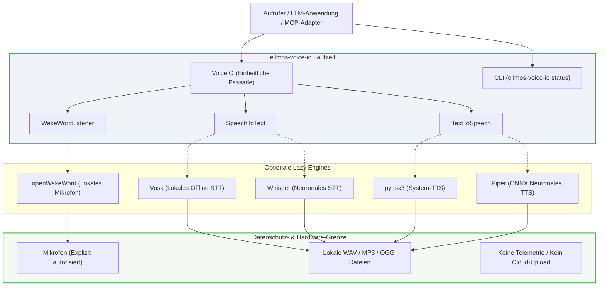

# ellmos-voice-io

[](https://www.python.org/)
[](CHANGELOG.md)
[](LICENSE)
[](tests/)
[](README_de.md#datenschutz-und-grenzen)
[](llms.txt)
[](https://github.com/ellmos-ai)
[](https://github.com/open-bricks)

**[English](README.md)** | **[Deutsch](README_de.md)**

> [!TIP]
> **Maschinenlesbare Dokumentation:** Ein [`llms.txt`](llms.txt)-Index steht für KI-Agenten, LLMs und automatisierte RAG-Pipelines bereit.

Lokale Speech-to-Text-, Text-to-Speech- und Wake-Word-Hilfen für LLM-Systeme.

`ellmos-voice-io` ist ein kleines, LLM-neutrales Laufzeitmodul. Es startet keinen Server, speichert keine Aufnahmen, liefert keine Stimmmodelle aus und wählt keinen Cloud-Provider. Aufrufer wählen optionale lokale Engines ausdrücklich und verantworten Mikrofonberechtigungen, Modelldownloads, Aufbewahrung und jede Netzwerkintegration.

---

## Architektur-Übersicht



---

## Umfang & Fähigkeiten

- **Dateibasiertes STT**: Speech-to-Text über optionales Whisper oder Vosk.
- **Lautsprecher- & Datei-TTS**: Text-to-Speech auf Lautsprecher oder in Dateien über optionales pyttsx3 oder Piper.
- **Lokales Wake-Word**: Lokale Mikrofon-Wake-Word-Erkennung in Echtzeit über optionales openWakeWord.
- **Stabile Python-API & Read-Only CLI**: Statusabfrage per `status`-CLI für Skills, MCP-Adapter und Desktop-Apps.

| Fähigkeit | Unterstützte Engines | Eingabe / Ausgabe | Kernmerkmal |
|---|---|---|---|
| **Speech-to-Text** | `vosk`, `whisper` | `.wav`-Datei $\to$ Text | Vollständig offline mit lokalem Modell |
| **Text-to-Speech** | `pyttsx3`, `piper` | Text $\to$ `.wav` / `.mp3` / `.ogg` / Lautsprecher | Systemstimmen oder neuronale ONNX-Synthese |
| **Wake-Word** | `openwakeword` | Mikrofonstream $\to$ Callback | Synchroner, aufrufer-kontrollierter Stopp |

Das Modul ersetzt bewusst keine Audio-Workstations wie KlangpultLight oder USBPodcastStudio. Deren Aufnahme-, Schnitt-, Streaming- und Transkript-Workflows bleiben anwendungsspezifische Konsumenten dieser engeren Fähigkeit.

---

## Installation

```bash
# Minimales Basispaket (ohne schwere optionale Abhängigkeiten)
pip install ellmos-voice-io

# Installation mit spezifischen optionalen Extras
pip install "ellmos-voice-io[stt-vosk,tts-pyttsx3]"

# Oder Installation aller verfügbaren lokalen Engines
pip install "ellmos-voice-io[all]"
```

Engine-Verfügbarkeit sicher prüfen ohne Hardware-Initialisierung:
```bash
ellmos-voice-io status
```

Ausgabe:
```json
{
  "stt_available": true,
  "stt_engine": "vosk",
  "tts_available": true,
  "tts_engine": "pyttsx3",
  "wakeword_available": false,
  "wakeword_engine": "Install the wakeword extra to access microphone-based wake words."
}
```

---

## Python API Beispiele

### Speech-to-Text (STT)

```python
from ellmos_voice_io import SpeechToText

# Vosk mit lokalem Modellpfad
stt = SpeechToText(engine="vosk", model_path="/pfad/zu/vosk-model-de")
transkript = stt.transcribe_file("input_voice.wav")
print(f"Transkribiert: {transkript}")

# Whisper
stt_whisper = SpeechToText(engine="whisper", model_size="base")
transkript_whisper = stt_whisper.transcribe_file("aufnahme.wav", language="de")
```

### Text-to-Speech (TTS)

```python
from ellmos_voice_io import TextToSpeech

tts = TextToSpeech(engine="pyttsx3", rate=160)

# Direkte Sprachausgabe auf Systemlautsprecher
tts.speak("Verarbeitung abgeschlossen.")

# Synthese in eine Audiodatei (.wav, .mp3, .ogg) exportieren
tts.speak_to_file("Benachrichtigungston erzeugt.", "output/meldung.wav")
```

### Wake-Word Listener

```python
import threading
from ellmos_voice_io import WakeWordListener

def on_wake():
    print("Wake-Word erkannt! Assistent wird aktiviert...")

stop_event = threading.Event()
listener = WakeWordListener(threshold=0.6)

# Blockiert synchron bis stop_event gesetzt wird; bereinigt Audio-Streams automatisch
listener.listen(on_wake=on_wake, stop_event=stop_event)
```

---

## Datenschutz und Grenzen

- **Audio, Transkripte und Ausgabedateien bleiben am vom Aufrufer bestimmten Ort.**
- **Kein Datenbankzugriff, keine Telemetrie, kein Konto, kein Hintergrunddienst, kein impliziter Upload.**
- **Mikrofonzugriff erfolgt ausschließlich während aktivem `WakeWordListener.listen()`.**
- **Rein lesende CLI**: `status` fordert keine Berechtigungen an und lädt keine Modelle herunter.

### Wake-Word-Lebenszyklus

`WakeWordListener.listen(on_wake, stop_event)` ist synchron und aufrufer-kontrolliert:
- Ein vorab gesetztes `stop_event` kehrt sofort zurück, ohne Audiogeräte zu öffnen.
- Jeder Audio-Chunk mit einer Vorhersage $\ge$ Schwellenwert löst den Callback genau einmal aus. Entprellung verbleibt beim Aufrufer.
- Das `stop_event` wird vor jedem Leseschritt geprüft. Modell-, Stream- und Lese-Ausnahmen werden nach geordnetem Beenden des Audiostreams sicher weitergereicht.

---

## Entwicklungsstatus & Roadmap

Die aktuellen Gatter und die nächsten prüfbaren Schritte stehen in [`ROADMAP.md`](ROADMAP.md).

---

## Herkunft

Das Modul rettet den generischen, MIT-lizenzierten Kern des früheren BACH Voice Service: Datei-STT, TTS-Dateiexport und Wake-Word-Anbindung. Es wurde als unabhängiges, nutzungsneutrales Paket neu aufgebaut – ohne BACH-Datenbank oder Bridge-Bindungen.

## Ökosystem & Geschwister-Werkzeuge

Teil der [ellmos-ai](https://github.com/ellmos-ai) Multi-Agenten-Infrastruktur und des übergeordneten [open-bricks](https://github.com/open-bricks) Open-Source-Software-Ökosystems:

| Werkzeug | Organisation | Beschreibung |
|---|---|---|
| [ellmos-core](https://github.com/ellmos-ai/ellmos-core) | ellmos-ai | Modulare KI-Laufzeit, Aufgaben-Dispatching & Agenten-Zustandssubstrat |
| [ellmos-scheduler](https://github.com/ellmos-ai/ellmos-scheduler) | ellmos-ai | Lokale Cron-, Intervall- & Ausführungsengine für geplante Aufgaben |
| [clutch](https://github.com/ellmos-ai/clutch) | ellmos-ai | Adaptiver Multi-Modell-LLM-Router & Agenten-Ausführungssteuerung |
| [coma](https://github.com/ellmos-ai/coma) | ellmos-ai | Standalone Multi-Agenten-Orchestrierer & Koordinations-Engine |
| [gardener](https://github.com/ellmos-ai/gardener) | ellmos-ai | Lokale autonome Sitzungs- und Kontextgedächtnis-Engine |
| [prompt-evidence-collector](https://github.com/ellmos-ai/prompt-evidence-collector) | ellmos-ai | Revisionssichere LLM-Interaktionserfassung & kryptografischer Beweisspeicher |
| [lock-master](https://github.com/ellmos-ai/lock-master) | ellmos-ai | Multi-Agenten-Dateisperr- und Nebenläufigkeits-Kontrollprotokoll |
| [ticket-master](https://github.com/ellmos-ai/ticket-master) | ellmos-ai | Autonome Ticket-Routing- und Aufgaben-Dispatching-Triagekonsole |
| [ellmos-controlcenter-mcp](https://github.com/ellmos-ai/ellmos-controlcenter-mcp) | ellmos-ai | MCP-Laufzeitüberwachung, Skill-Routing & Werkzeugbündel-Erkennung |
| [ellmos-filecommander-mcp](https://github.com/ellmos-ai/ellmos-filecommander-mcp) | ellmos-ai | MCP-Dateiverwaltung, sichere Löschung & Archivierungs-Server |
| [ellmos-codecommander-mcp](https://github.com/ellmos-ai/ellmos-codecommander-mcp) | ellmos-ai | MCP-Codeanalyse, AST-Transformationen & Formatierungs-Server |
| [ellmos-clatcher-mcp](https://github.com/ellmos-ai/ellmos-clatcher-mcp) | ellmos-ai | MCP-Zwischenablage & Notizblock-Manager mit Dry-Run-Sicherheit |
| [n8n-manager-mcp](https://github.com/ellmos-ai/n8n-manager-mcp) | ellmos-ai | MCP-n8n-Workflow-Management, Ausführungsüberwachung & Node-Introspektion |
| [skills](https://github.com/ellmos-ai/skills) | ellmos-ai | Kanonische Multi-Agenten-Fähigkeitsbibliothek & Agenten-Katalog |
| [usb-podcast-studio](https://github.com/entertain-and-more/usb-podcast-studio) | entertain-and-more | Desktop-Audio-Workstation, Soundboard & Aufnahme-Suite (Klangpult) |
| [companion-for-agy](https://github.com/ellmos-ai/companion-for-agy) | ellmos-ai | Terminal-Begleiter & PTY-Wrapper für Google Antigravity |
| [safe-start-for-codex](https://github.com/dev-bricks/safe-start-for-codex) | dev-bricks | Sicherer Starter und Berechtigungsisolator für Codex CLI-Sitzungen |
| [automizer-for-claude-desktop](https://github.com/dev-bricks/automizer-for-claude-desktop) | dev-bricks | Aufgaben-Automationsmanager für Claude Desktop |
| [DevCenter](https://github.com/dev-bricks/DevCenter) | dev-bricks | Entwickler-Leitstand, Repository-Dashboard & Umgebungsmanager |
| [CodeBox](https://github.com/dev-bricks/CodeBox) | dev-bricks | Polyglotter Code-Snippet-Manager & Entwickler-Werkbank |
| [open-bricks](https://github.com/open-bricks) | open-bricks | Dachkatalog für Open-Source-Bausteine, Werkzeuge und Bibliotheken |

---

## Lizenz

MIT Lizenz. Siehe [LICENSE](LICENSE) für Details.
